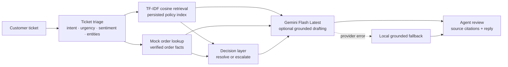

# ShopSense AI — submission deliverables

## Architecture diagram



## CTO-facing narrative

ShopSense AI is a Day 30 customer support intelligence pilot for a fictional direct-to-consumer brand. The design focuses on the highest-value operational loop: turn an unstructured customer message into a safe, reviewable support action. A ticket first passes through triage, where the system extracts intent, urgency, sentiment, order identifiers, product references, and timeframes. This creates a consistent case representation before any response is drafted.

The retrieval layer uses a persisted local TF-IDF cosine index over approved support policies. It is intentionally inspectable: every result includes a policy ID, title, score, and source excerpt. This lets an agent see why a policy was selected and gives the response generator bounded source material. The system then looks up the order against a mock order service. In a production rollout this boundary would be replaced by an authenticated commerce or OMS integration, but the demo keeps the contract explicit and deterministic.

The decision layer is the safety boundary. It combines the ticket classification, retrieved policy, and verified order facts to decide whether the case is safe to resolve or requires human review. Billing, refund, damage, return, cancellation, and address-change cases are routed to an agent because they can create financial or account consequences. Missing order context, missing policy support, and time-sensitive exceptions also produce a handoff. The drafted reply contains the verified facts and cites the policy source in the interface.

Gemini Flash Latest is an optional generation provider. The server sends the ticket, retrieved policy passages, and verified order context to the model, validates the structured response, and keeps the local grounded draft when the provider is unavailable. This makes the demo reliable during a walkthrough while keeping the model boundary clear. API keys remain server-side in an ignored environment file.

The pilot is intentionally production-shaped rather than production-complete. The next phase is to connect real ticket and order APIs, add authentication and role-based access, replace the local index with a managed vector service when the corpus grows, and instrument latency, retrieval quality, escalation accuracy, containment, and CSAT. We would evaluate against a labeled ticket set, review false resolutions with agents, and tune thresholds before enabling automatic sends. The architecture gives the team a working vertical slice and clear seams for those upgrades.

## Trade-off log

| Decision | Benefit | Cost / next step |
|---|---|---|
| Local TF-IDF index | Zero infrastructure, deterministic, inspectable citations | Lexical rather than semantic; move to embeddings plus a managed vector store as the policy corpus grows |
| Rule-based fallback triage | Works without model quota and is easy to audit | Limited vocabulary and weaker nuance; evaluate a trained classifier or model-based triage |
| Optional Gemini generation | Better natural-language handling without making the demo depend on it | Provider availability and quota can vary; retain fallback and add retries/observability |
| Mock order data | Safe, reproducible demo and clear API boundary | Not production truth; connect authenticated OMS/order APIs |
| Human escalation for sensitive intents | Prevents unsupported refunds or account changes | Lower automation rate; tune policy and thresholds with agent-reviewed outcomes |

## Sample JSON triage outputs

```json
{
  "intent": "Order status",
  "urgency": "High",
  "sentiment": "Concerned",
  "entities": [
    {"type": "Order ID", "value": "ORD-48291"},
    {"type": "Timeframe", "value": "yesterday"}
  ]
}
```

```json
{
  "intent": "Billing",
  "urgency": "High",
  "sentiment": "Negative",
  "entities": [{"type": "Order ID", "value": "ORD-48288"}]
}
```

```json
{
  "intent": "Order change",
  "urgency": "Normal",
  "sentiment": "Neutral",
  "entities": [{"type": "Order ID", "value": "ORD-48285"}]
}
```

## Three RAG response examples

### 1. Shipping delay — resolve with update

**Retrieved:** `KB-DEL-04` — Shipping delays & carrier scans (cosine score `0.33`).

**Grounded response:** “I checked order ORD-48291: it is currently in transit and the carrier has not posted a new scan. If it is still within the delivery window, please check back in 2 business days.”

### 2. Duplicate charge — escalate

**Retrieved:** `KB-BIL-01` — Duplicate charge investigation.

**Grounded response:** “I’ve flagged order ORD-48288 for billing to verify whether both charges have posted. I can’t confirm a refund until that review is complete.”

### 3. Damaged item — agent review

**Retrieved:** `KB-RET-02` — Damaged item replacement policy.

**Grounded response:** “I’m sorry your mug arrived damaged. I’ve sent this to support to confirm a replacement or refund option and verify inventory.”
